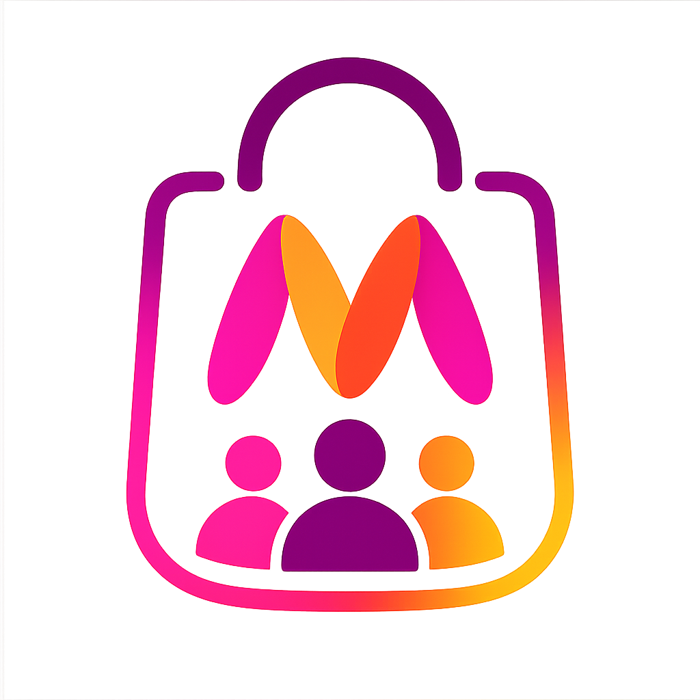

<div align="center">
  

  <h1 align="center">Fashion Rooms</h1>

  <p align="center">
    <strong>AI-Powered Collaborative Social Shopping</strong>
    <br />
    Shop together. Decide together. Earn together.
    <br />
    <br />
    <a href="https://github.com/bhaviniawasthi1/fashion-rooms/issues">Report Bug</a>
    ·
    <a href="https://github.com/bhaviniawasthi1/fashion-rooms/issues">Request Feature</a>
  </p>

  <!-- Badges -->
  <p>
    
    
    
    
    
    
    
    
    <br />
    
  </p>
</div>

---

## 📋 Table of Contents

- [Problem](#-problem)
- [Solution](#-solution)
- [Key Features](#-key-features)
- [Screenshots](#-screenshots)
- [Architecture](#-architecture)
- [Tech Stack](#-tech-stack)
- [Getting Started](#-getting-started)
- [API Overview](#-api-overview)
- [Project Structure](#-project-structure)
- [Environment Variables](#-environment-variables)

---

## 🎯 Problem

Online shopping is inherently solitary. Friends and family browsing the same products cannot deliberate, vote, or make purchase decisions together in real time. Group gifting, coordinated outfit planning, and shared haul decisions require endless back-and-forth across messaging apps with no integration to the actual shopping experience. Existing solutions lack:

- **Real-time collaboration** — no way to build a shared cart with a group
- **Group decision-making** — no voting or consensus tools for purchases
- **Conversational AI** — no stylist assistance within the shopping flow
- **Shared incentives** — no reward system that incentivizes group purchases

---

## 💡 Solution

**Fashion Rooms** transforms shopping from a solo activity into a shared, social experience. Users create or join rooms with friends, browse products together, add items to a shared cart, vote on what to buy, chat in real time, and earn rewards when the group commits to a purchase.

At the heart of the experience is **@Maya**, an AI stylist integrated directly into room conversations who provides personalized fashion advice, trend insights, and purchase recommendations.

---

## ✨ Key Features

### 🛍️ Collaborative Shopping Rooms
Create invite-only shopping rooms with friends. Browse the catalog and add products to a shared room cart visible to all members in real time.

### 🗳️ Group Voting & Consensus
Vote thumbs up or down on each product in the room cart. Cast preferences on color and size. See live tallies so the group knows exactly what everyone wants.

### 💬 Real-Time Chat with AI Stylist
Persistent room chat powered by Socket.IO with typing indicators, online presence, and message history. **@Maya** — the AI fashion stylist — answers style questions, recommends outfits, and helps the group decide.

### 🪙 MynCoins Rewards
When 75% or more of room members purchase an item, everyone earns MynCoins (10 MynCoins = ₹1). Coins are credited automatically and expire after 2 months, incentivizing timely group purchases.

### 🛒 Dual Cart System
- **Personal Cart** — individual checkout for solo purchases
- **Room Cart** — shared cart with per-member color/size selection and group checkout progress tracking

### 📊 Room Analytics
Track purchase completion rates, member contribution, and reward distribution per room. See who has purchased what at a glance.

### 📦 Consolidated Orders
A unified orders page that aggregates both personal and room purchases, with reward earnings displayed alongside each group transaction.

---

## 📸 Screenshots

> *Add screenshots of your application here demonstrating key flows.*

| Landing Page | Room Chat | Room Cart |
|:---:|:---:|:---:|
|  |  |  |

| Product Discovery | MynCoins Dashboard | Orders |
|:---:|:---:|:---:|
|  |  |  |

---

## 🏗️ Architecture

```
┌─────────────────────────────────────────────────────┐
│                    Client (Vite)                      │
│  React 19 · TypeScript 7 · Tailwind CSS 4 · Router 7 │
│  ┌──────────┐ ┌──────────┐ ┌──────────────────────┐ │
│  │  Pages   │ │Components│ │  Context Providers    │ │
│  │          │ │          │ │ (Auth, Socket, Chat)  │ │
│  └────┬─────┘ └────┬─────┘ └──────────┬───────────┘ │
│       └────────────┴──────────────────┘              │
│                        │ HTTP / WebSocket             │
└────────────────────────┼────────────────────────────┘
                         │
┌────────────────────────┼────────────────────────────┐
│               Server (Express 5)                     │
│  ┌──────────┐ ┌──────────┐ ┌──────────────────────┐ │
│  │  Routes  │ │ Services │ │  Socket.IO Handlers   │ │
│  │  (REST)  │ │ (Logic)  │ │ (Presence, Chat, AI) │ │
│  └────┬─────┘ └────┬─────┘ └──────────┬───────────┘ │
│       └────────────┴──────────────────┘              │
│                        │                             │
│              ┌─────────┴─────────┐                   │
│              │   better-sqlite3  │                   │
│              │   (SQLite)        │                   │
│              └───────────────────┘                   │
└─────────────────────────────────────────────────────┘
```

### Data Flow
1. **Authentication** — JWT issued on login, attached to all API requests and Socket.IO handshake
2. **Real-Time Events** — Socket.IO broadcasts cart updates, chat messages, presence changes, and vote tallies to all room members
3. **AI Integration** — Messages mentioning `@Maya` are routed to the OpenAI API with fashion-specific context
4. **Reward Calculation** — On each purchase, the checkout service checks the 75% threshold per room and credits MynCoins with 2-month expiry

---

## 🛠️ Tech Stack

### Frontend
| Technology | Purpose |
|------------|---------|
| [React 19](https://react.dev/) | UI library with concurrent features |
| [Vite 8](https://vite.dev/) | Build tool and dev server |
| [TypeScript 7](https://www.typescriptlang.org/) | Type safety |
| [Tailwind CSS 4](https://tailwindcss.com/) | Utility-first styling |
| [React Router 7](https://reactrouter.com/) | Client-side routing |
| [Socket.IO Client](https://socket.io/) | Real-time bidirectional communication |
| [Axios](https://axios-http.com/) | HTTP client |

### Backend
| Technology | Purpose |
|------------|---------|
| [Express 5](https://expressjs.com/) | HTTP server and routing |
| [Socket.IO](https://socket.io/) | WebSocket server for real-time events |
| [better-sqlite3](https://github.com/WiseLibs/better-sqlite3) | Synchronous SQLite database |
| [TypeScript 7](https://www.typescriptlang.org/) | Type safety |
| [JWT (jsonwebtoken)](https://github.com/auth0/node-jsonwebtoken) | Authentication tokens |
| [bcryptjs](https://github.com/dcodeIO/bcrypt.js) | Password hashing |
| [OpenAI SDK](https://github.com/openai/openai-node) | AI stylist integration |
| [dotenv](https://github.com/motdotla/dotenv) | Environment variable management |

---

## 🚀 Getting Started

### Prerequisites
- **Node.js** >= 18
- **npm** >= 9

### Installation

```bash
# 1. Clone the repository
git clone https://github.com/bhaviniawasthi1/fashion-rooms.git
cd fashion-rooms

# 2. Install server dependencies
cd server
npm install

# 3. Install client dependencies
cd ../client
npm install

# 4. Configure environment variables
cd ../server
cp .env.example .env
# Edit .env with your values (see Environment Variables section)
```

### Development

Run the server and client concurrently in separate terminals:

```bash
# Terminal 1 — Start the API server
cd server
npm run dev

# Terminal 2 — Start the frontend dev server
cd client
npm run dev
```

The client runs on `http://localhost:5173` with hot module replacement. API requests are proxied to `http://localhost:3001`.

### Production

```bash
# Build the client
cd client
npm run build

# Build the server
cd ../server
npm run build

# Start the production server (serves both API and built client)
cd server
npm start
```

Visit **http://localhost:3001** in production mode.

---

## 📡 API Overview

### Authentication
| Method | Endpoint | Description |
|--------|----------|-------------|
| `POST` | `/api/auth/register` | Create a new account |
| `POST` | `/api/auth/login` | Sign in and receive JWT |

### Products
| Method | Endpoint | Description |
|--------|----------|-------------|
| `GET` | `/api/products` | List all products (supports `?category=` and `?search=`) |
| `GET` | `/api/products/:id` | Get product details |
| `POST` | `/api/cart/add` | Add item to personal cart |
| `GET` | `/api/cart` | Get personal cart items |
| `POST` | `/api/cart/checkout` | Checkout personal cart |

### Rooms
| Method | Endpoint | Description |
|--------|----------|-------------|
| `POST` | `/api/rooms/create` | Create a new room |
| `GET` | `/api/rooms` | List user's rooms |
| `GET` | `/api/rooms/:id` | Get room details |
| `POST` | `/api/rooms/join` | Join a room by invite code |

### Room Cart & Checkout
| Method | Endpoint | Description |
|--------|----------|-------------|
| `GET` | `/api/rooms/:id/cart` | Get shared cart items |
| `POST` | `/api/rooms/:id/cart/add` | Add product to room cart |
| `DELETE` | `/api/rooms/:id/cart/:itemId` | Remove item from room cart |
| `POST` | `/api/rooms/:id/checkout` | Purchase an item from room cart |
| `GET` | `/api/rooms/:id/checkout` | Get checkout status |

### Voting
| Method | Endpoint | Description |
|--------|----------|-------------|
| `POST` | `/api/rooms/:id/vote` | Cast or toggle a vote |
| `GET` | `/api/rooms/:id/votes/:productId` | Get vote tallies |

### MynCoins & Orders
| Method | Endpoint | Description |
|--------|----------|-------------|
| `GET` | `/api/myncoins` | Get coin balance and history |
| `GET` | `/api/orders` | Get all orders (room + personal) |

### Analytics
| Method | Endpoint | Description |
|--------|----------|-------------|
| `GET` | `/api/rooms/:id/analytics` | Get room purchase analytics |

---

## 📂 Project Structure

```
fashion-rooms/
│
├── client/                          # React frontend
│   ├── public/                      # Static assets (favicon, icons)
│   ├── src/
│   │   ├── components/              # Reusable UI components
│   │   │   └── room/                # Room-specific components (VoteArea, Chat, etc.)
│   │   ├── context/                 # React Context providers
│   │   │   ├── AuthContext.tsx       # Authentication state
│   │   │   ├── SocketContext.tsx     # WebSocket connection management
│   │   │   ├── ChatContext.tsx       # Global chat state
│   │   │   └── ToastContext.tsx      # Toast notifications
│   │   ├── hooks/                   # Custom React hooks
│   │   ├── lib/                     # Utilities (API client)
│   │   ├── pages/                   # Route page components
│   │   └── types/                   # TypeScript type definitions
│   ├── index.html
│   ├── vite.config.ts
│   └── tsconfig.json
│
├── server/                          # Express backend
│   ├── src/
│   │   ├── data/                    # Seed data
│   │   ├── db/                      # Database initialization and migrations
│   │   ├── middleware/              # Express middleware (auth)
│   │   ├── routes/                  # API route handlers
│   │   ├── services/                # Business logic layer
│   │   ├── socket/                  # Socket.IO event handlers
│   │   │   └── handlers/            # Individual handler modules
│   │   ├── types/                   # TypeScript type definitions
│   │   └── utils/                   # Utility functions
│   ├── .env.example                 # Environment variable template
│   ├── package.json
│   └── tsconfig.json
│
├── package.json                     # Root workspace scripts
├── .gitignore
└── README.md
```

---

## 🔐 Environment Variables

| Variable | Required | Default | Description |
|----------|----------|---------|-------------|
| `PORT` | No | `3001` | Server listening port |
| `JWT_SECRET` | **Yes** | — | Secret key for signing JSON Web Tokens |
| `CLIENT_URL` | No | `http://localhost:5173` | Allowed CORS origin (development) |
| `OPENAI_API_KEY` | No | — | OpenAI API key for the @Maya AI stylist |

---

## 📄 License

This project is licensed under the MIT License — see the [LICENSE](LICENSE) file for details.

---

<div align="center">
  <sub>Built with ❤️ using React, Express, and Socket.IO</sub>
</div>
